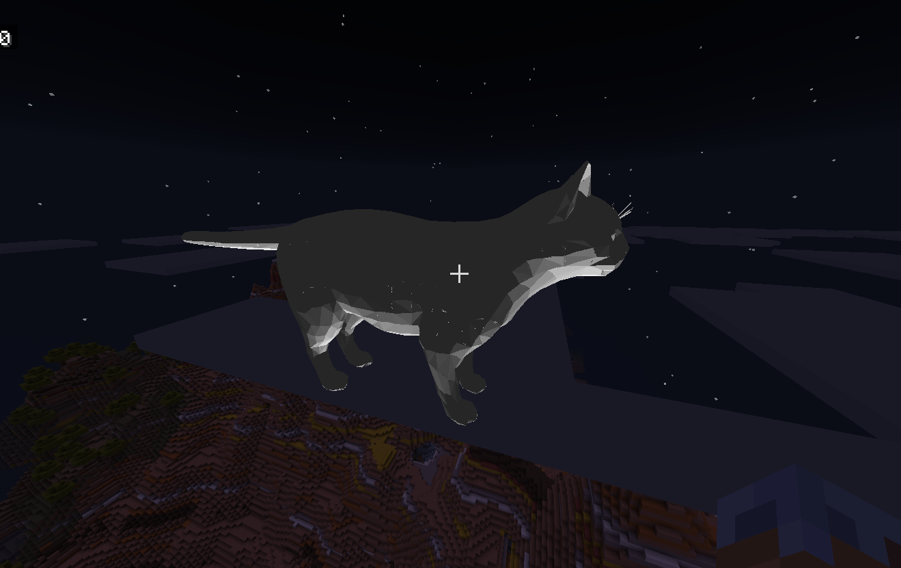

# MCPE-DebugRenderer

A Minecraft Bedrock Edition script that loads and renders 3D OBJ models as debug lines in the world using the `@minecraft/debug-utilities` API.

## Features

-   Loads OBJ model data (vertices and faces) from a string.
-   Renders the model as wireframe using debug lines.
-   Supports adjustable scale, fill density, and lighting direction.
-   Automatically starts rendering when a player spawns.

## Usage

1. Place your OBJ model as a string export in `scripts/obj/`.
2. Import and use the model in `scripts/index.js`:

```js
import { model } from "./obj/model.js";
```

3. You can then load a model like this

```js
const loadedModel = await loadOBJ(model);
system.runJob(renderOBJ(loadedModel, { x: 0, y: 200, z: 0 }, 1, 1, { x: 0, y: 400, z: 0 }));
```

### Warning Loading models might take a while

## Exmaple

for this one I forgot where exactly the light pos was

```js
import { model } from "./obj/cat.js";
// other code
const loadedModel = loadOBJ(model);
system.runJob(renderOBJ(loadedModel, { x: 0, y: 200, z: 0 }, 0.1, 8));
```

